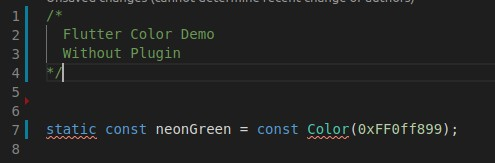
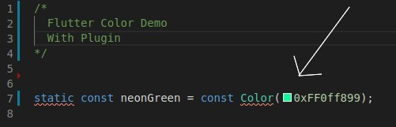

# Welcome to Flutter Color Show VS Code Extension

## A user friendly plugin to help you work with ARGB Color in VS Code, in any project. You can easily use it. It will automatically convert your ARGB Color Code and show you a color box.  The size of the color box is set by VS Code, we can't change it

## This plugin help you to visible color easily

### Without Fultter Color

### With Fultter Color

## Feel free to contribute. Any new ideas are accepted, if you want to contribute, submit a pull request

### Made with ( :heart: ) by CCS
